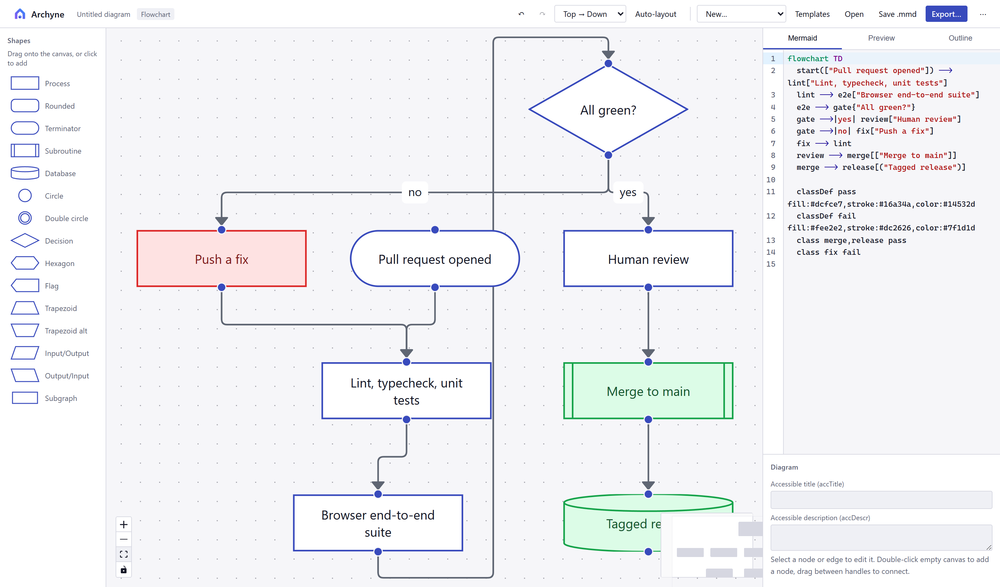
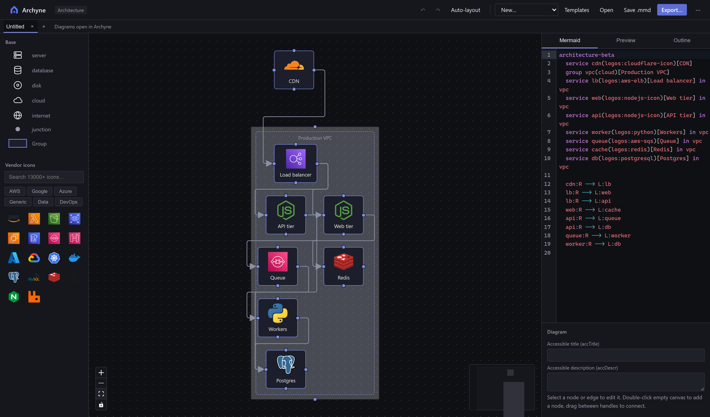
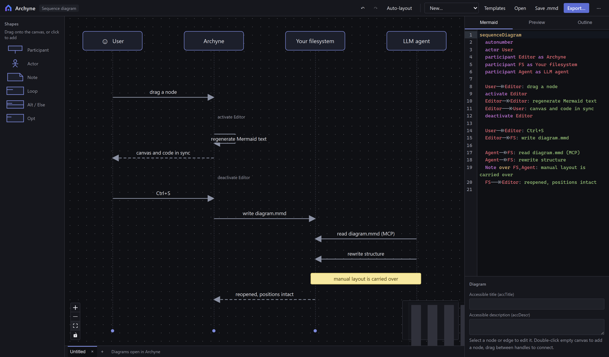

<p align="center">
  
</p>

# Archyne — a visual editor for Mermaid diagrams

A draw.io-style diagram editor with **two-way sync to Mermaid code**. Edit visually
(drag-and-drop, connect, rename) or edit the Mermaid text — each side updates the
other. Because the document _is_ standard Mermaid, LLMs can generate, read, and
modify your diagrams as plain text, and anything they produce opens on the canvas.

Runs entirely on your own machine — in a browser, as a desktop app, or inside
VS Code. No server, no accounts, nothing leaves it. Self-host by serving the
`dist/` folder from any static file server.

<p align="center">
  <a href="https://github.com/dariodd/archyne/actions/workflows/ci.yml"></a>
  <a href="https://www.npmjs.com/package/archyne"></a>
  <a href="LICENSE"></a>
</p>

## Try it

**[Open the live demo →](https://dariodd.github.io/archyne/)** — it is the same
static build, running in your browser. Nothing is uploaded.

Or run it locally, with no clone and no build:

```sh
npx archyne                 # opens http://localhost:4173
npx archyne diagram.mmd     # …with a diagram already loaded
```

Or inside the editor you already have open:

```sh
code --install-extension naxeris.archyne
```

Archyne registers as an optional editor for `.mmd`, so the file stays VS Code's
— its dirty dot, its undo, its save, its diff against `HEAD`. A
` ```mermaid ` block inside Markdown gets an **Open on canvas** action above the
fence, which is where most Mermaid actually lives: the diagram is edited in
place, and the rest of the document is left alone. It is on the
[Marketplace](https://marketplace.visualstudio.com/items?itemName=naxeris.archyne)
and on [Open VSX](https://open-vsx.org/extension/naxeris/archyne), for
VSCodium, Cursor, Windsurf, Gitpod and Theia.

Desktop builds for Windows, macOS and Linux are attached to every
[release](https://github.com/dariodd/archyne/releases/latest). They are **not
yet code-signed** — Windows warns, macOS needs one `xattr` command — and each
release page says so; the web version and `npx archyne` avoid the question
entirely.

<p align="center">
  
</p>

<table>
<tr>
<td width="50%">

<p align="center"><em>Architecture diagrams with 16 000+ searchable vendor icons</em></p>
</td>
<td width="50%">

<p align="center"><em>Sequence diagrams — drag participants to reorder</em></p>
</td>
</tr>
</table>

The screenshots are generated from the real app by
`node scripts/screenshots.mjs`, so they cannot quietly go stale.

## Run

```sh
npm install
npm run dev            # development, http://localhost:5173
npm run build          # production build into dist/ (static, any web server)
npm start              # serve the build locally (same as npx archyne)
npm test               # round-trip parser/serializer tests
npm run mcp            # MCP server (stdio) for LLM agents
npm run mcp:smoke      # end-to-end MCP server test
npm run desktop        # desktop app (Electron shell around the build)
npm run desktop:build  # Windows installer (NSIS) into release/
```

There is no backend: the web build is static files, the desktop app is the
same build in an Electron window, and diagrams live in your files. Opening a
`.mmd` file with the desktop app loads it directly (the installer registers
the file association), and **Save writes back to that same file** — as it does
in the browser too, on engines with the File System Access API. Elsewhere,
Save falls back to a download.

Diagram families Archyne has no visual editor for — `gantt`, `pie`, `mindmap`
and friends — still open, rendered read-only, with the Mermaid code fully
editable and the file untouched on save.

## Importing files that are not Mermaid

**Import…** (in the overflow menu) takes six other formats and converts each
into the Mermaid diagram it most nearly is. It is deliberately not the same
action as Open: opening a file means editing it and saving it back, and an
import is never written back.

**Every conversion is shown before it lands.** The importer runs, and what it
produced is put up in a preview — the diagram drawn by Mermaid's own renderer,
what kind it became, how many elements and connections came across, and every
caveat that applies: pages skipped, elements with no equivalent, a drawing
that looked like a different sort of diagram. The preview opens on a read-only Archyne
canvas — the same components the editor draws with, so it is what you will
get, with zoom and pan — and two buttons switch to Mermaid's own rendering
and to the generated source. Where a source can be read more than one way —
PlantUML could be three things, draw.io two — **Read as** lets you overrule
the detection and see the other reading before deciding. Cancel costs nothing, because nothing has been
placed yet. An import is lossy by construction, and the moment to find that
out is before it has replaced what you were looking at. **The original file is never touched**: an import arrives
unbound from its source, so Save is Save-as into a new `.mmd` and nothing is
overwritten with Mermaid its own tool could not read back. Whatever could not
come across is counted rather than passed over in silence.

| Format                           | Becomes                    | Carried across                                                                                                                                                       |
| -------------------------------- | -------------------------- | -------------------------------------------------------------------------------------------------------------------------------------------------------------------- |
| **PlantUML** `.puml` `.plantuml` | sequence, class or state   | Read off the file. Messages and participants; or classes, members and relations; or states and transitions.                                                          |
| **Graphviz** `.dot` `.gv`        | flowchart, or class        | A file drawn entirely with `shape=record` labels is a class model — what doxygen emits — and is read as one.                                                         |
| **SQL DDL** `.sql` `.ddl`        | ER diagram                 | Tables, columns, types, PK/FK/UK, and foreign keys whose cardinality is read off the constraints.                                                                    |
| **draw.io** `.drawio` `.xml`     | flowchart, or architecture | Shapes, colours, containers, edge labels, geometry, hand-routed corners. An AWS, Azure, GCP or Kubernetes drawing becomes an architecture diagram, stencils and all. |
| **Visio** `.vsdx`                | flowchart                  | Shapes by master, text, literal colours, connectivity, page geometry.                                                                                                |
| **Excalidraw** `.excalidraw`     | flowchart                  | Boxes, ellipses, diamonds, bound text, bound arrows, frames, geometry.                                                                                               |

### Graphviz DOT

`.dot` and `.gv`, directed or not, `strict` or not. Nodes, edges, shapes,
colours, `rankdir`, edge labels and line styles, and `cluster_*` subgraphs as
containers — DOT describes a graph rather than a drawing, so there is very
little that has no counterpart. Plain subgraphs stay invisible, as they are in
Graphviz. A file with no coordinates is laid out with ELK; one that has been
through `dot -Tdot` keeps the positions it was given.

The point is the DOT nobody writes by hand. `terraform graph`, `go mod graph`,
doxygen, dbt and most build tools emit it, and it is usually squinted at in
whichever viewer is nearest:

```sh
terraform graph > graph.dot   # then open graph.dot
```

Node ids are named after the labels, so what you get is source worth reading
rather than `n1 --> n2`.

### draw.io

`.drawio` (and the `.xml` older versions write). What comes across is the part
that was drawn: the boxes and their text, the shape each one is, its colours,
the connections and their labels and line styles, the containers, and **where
everything sat** — the geometry lands in the `%% graph:positions` comment, so
an imported diagram opens looking like the one you left rather than
re-laid-out from scratch. Hand-routed corners come too.

It is a migration, not a mirror. draw.io is a free-form geometry editor and
Mermaid is not, so rotation, layers, per-shape fonts and the thousands of
stencils have no equivalent and do not survive; Mermaid's fourteen vertex
shapes are matched as closely as they can be, and anything unrecognised
becomes a rectangle. A file with several pages converts the first, and you
are told so.

### SQL DDL

A schema is already an ER diagram, written down as `CREATE TABLE`. Tables
become entities, columns become typed attributes, and a foreign key becomes a
relationship whose cardinality is **read off the constraints** rather than
guessed: the child end is many unless the column is unique, the parent end is
optional when the column is nullable, and the line is solid — identifying —
only when the key is part of the child's own primary key.

Dialect-agnostic and deliberately shallow: it reads the statements that
describe shape and steps over views, triggers, grants, indexes and
partitioning, which is what lets a whole `pg_dump` be opened rather than a
hand-trimmed excerpt. Constraints added afterwards with `ALTER TABLE` — how a
dump always writes them — count the same as inline ones.

### PlantUML

**Sequence diagrams only.** PlantUML is a dozen languages sharing a pair of
`@start`/`@end` markers, and the sequence grammar is the one that lines up
with Mermaid closely enough to convert without guessing. A class, state or
component diagram is refused _by name_ rather than half-converted into
something you would have to check line by line.

Within sequence diagrams: participants and their kind, messages and arrow
styles, activation (including the `++` shorthand), notes, and the
`alt`/`else`/`opt`/`loop`/`par`/`break`/`critical` blocks. Not carried:
`skinparam` and colours, the preprocessor, `box` participant grouping,
dividers and delays.

### Which diagram you get

The three text formats say what they are, so the family is read off the file
rather than fixed: a PlantUML `class` keyword produces a Mermaid class
diagram, `[*] -->` produces a state diagram, and a DOT file drawn entirely
with record labels produces a class diagram instead of boxes full of pipe
characters.

The three drawing formats do not say. draw.io, Visio and Excalidraw all put
every kind of diagram on the same canvas, so a sequence diagram there is
lifeline _shapes_ rather than a sequence _diagram_. Those import as
flowcharts — but draw.io is checked for the tell-tale styles, and a drawing
that looks like a sequence, ER or class diagram says so on import rather than
leaving you to work out why it came across as boxes. Excalidraw has no
semantic types at all, so there is nothing to read.

### Visio and Excalidraw

Visio `.vsdx` is read out of its package: shapes with their text, the shape
each master suggests, literal colours, the `<Connects>` table as edges, and
the page geometry — centres in inches from the bottom of the sheet, turned
into corners in pixels from the top. Containers, layers, themes and the
sub-shapes of a group are not attempted; a Visio group is one composite
stencil far more often than a logical container, so it arrives as the single
shape it looks like.

Excalidraw scenes give up their boxes, ellipses and diamonds with the text
bound to them, the arrows their bindings name, frames as containers, and the
positions. Freehand strokes, images and loose text have no counterpart and
are counted out.

> Windows note: if `desktop:build` fails with `EPERM … rename win-unpacked`,
> your project sits in a Defender-protected folder (e.g. Documents). Build
> with the output elsewhere:
> `npx electron-builder --win -c.directories.output=%LOCALAPPDATA%\archyne-release`

## Embedding Archyne in another app

Load the app with `?embed=1` inside an iframe and talk to it over
`postMessage`. In embed mode Archyne never touches localStorage — the host
owns the data.

The bridge is **default-deny**: you must name your origin with
`&origin=https://your.app`, and diagram content is only ever posted back to an
origin on that list. Comma-separate several if you need to. `origin=*` accepts
any parent frame and is for local development only.

```html
<iframe id="mf" src="https://archyne.your.host/?embed=1&origin=https://your.app"></iframe>
<script>
  const MF = "https://archyne.your.host";
  const mf = document.getElementById("mf").contentWindow;
  window.addEventListener("message", (e) => {
    if (e.origin !== MF) return; // verify the sender, too
    if (e.data.type === "ready")
      mf.postMessage({ type: "load", code: "flowchart TD\n a-->b" }, MF);
    if (e.data.type === "change") save(e.data.code); // live edits, debounced
    if (e.data.type === "exported") show(e.data.dataUrl); // png/svg data URL
  });
  // on demand:
  mf.postMessage({ type: "getCode" }, MF); // → { type:"code", code }
  // format: "png" | "svg" | "pdf"
  mf.postMessage({ type: "export", options: { format: "png", background: "light" } }, MF);
</script>
```

Messages from the editor: `ready`, `loaded`, `change {code}`, `code {code}`,
`exported {format, dataUrl}`, `error {message}`. A working example ships at
`/embed-demo.html`.

## MCP server — let agents edit your diagrams

`mcp/server.ts` exposes the diagrams as MCP tools, so Claude Code (or any MCP
client) can work with them directly. The included `.mcp.json` registers it
automatically when you open this project in Claude Code; elsewhere:

```sh
claude mcp add archyne -- npx tsx mcp/server.ts
```

| Tool               | What it does                                               |
| ------------------ | ---------------------------------------------------------- |
| `list_diagrams`    | Find all `.mmd` files under `GRAPH_DIR` (default: cwd)     |
| `read_diagram`     | Raw mermaid source + parsed structure (nodes/edges/groups) |
| `validate_mermaid` | Parse-check code without writing                           |
| `write_diagram`    | Validated write; rejects broken mermaid outright           |

Writes are safe by construction: invalid code never touches disk, paths can't
escape the root, and if an agent rewrites a diagram without the
`%% graph:positions` and `%% graph:waypoints` lines, the previous manual
layout is carried over for the nodes and edges that still exist — an LLM
restructuring your diagram won't scramble your hand-arranged layout.

**Live co-editing.** A file open in the editor is watched, so an agent's write
lands on the canvas within a couple of seconds without a reload. A document
with unsaved changes is never overwritten: you are told the file moved and
your work stays, with **Reload from disk** in the overflow menu when you want
the other version.

## How it works

- **Canvas → code**: structural edits (add/delete/connect/rename/reshape) regenerate
  the Mermaid text; dragging a node only rewrites the positions comment, leaving the
  rest of your text untouched.
- **Code → canvas**: the text is parsed with mermaid's own parser, so anything
  mermaid accepts renders on the canvas. Parse errors are shown without destroying
  the last good canvas state.
- **Layout** lives in trailing comments the rest of the world ignores — node
  positions and sizes in one, the corners of hand-routed edges in another:

  ```
  %% graph:positions {"start":{"x":0,"y":0},"db":{"x":40,"y":300,"w":220,"h":90}}
  %% graph:waypoints {"start>check":[[120,80]]}
  ```

  So the file stays a 100% valid Mermaid diagram (GitHub, Notion, LLMs, mermaid-cli
  all render it), while your manual layout survives save/reload/LLM-edit cycles.
  Diagrams without a positions line are auto-laid-out with ELK. Edges are keyed
  by their endpoints rather than by index, so inserting a line above one does
  not move its corners onto a different connection.

## Current scope

Seven Mermaid diagram families, all with visual editing and two-way sync.
Anything else Mermaid can draw — gantt, pie, mindmap, timeline — opens
read-only, rendered rather than refused.

- **Flowcharts** — all 14 vertex shapes, all edge stroke/arrow types,
  subgraphs as groups (create/dissolve from the toolbar), and full
  `classDef`/`style` round-trip with color pickers in the inspector.
- **State diagrams** (`stateDiagram-v2`) — states, start/end pseudo-states,
  transitions with labels, composite states as groups (nested transitions
  round-trip correctly).
- **ER diagrams** — entities with typed attributes/keys/comments, crow's-foot
  cardinalities, identifying vs non-identifying relationships.
- **Class diagrams** — fields and methods (with abstract/static classifiers),
  «interface» annotations, generics, namespaces as groups, sticky notes,
  inheritance/composition/aggregation/dependency markers, cardinalities,
  dotted relations.
- **Sequence diagrams** — participants/actors as draggable columns with
  lifelines (drag horizontally to reorder), messages as ordered horizontal
  arrows with all eight operators; drag a message by its grab strip to
  reorder it, into or out of a block, or step it from the inspector. Notes and
  loop/alt/opt blocks are created from the palette (drop them at a row),
  renamed and deleted in place; par/critical/break blocks, activations, and
  autonumber are rendered and fully preserved through any canvas edit.
- **Architecture diagrams** (`architecture-beta`) — cloud/solution
  architecture with **vendor icons** — Microsoft's own **636 Azure
  architecture icons** are bundled (`azure:virtual-networks`, and the
  catalogue codes other tools write resolve too), alongside the Iconify
  `logos`, `devicon`, `carbon`, `tabler` and `simple-icons` collections:
  more than 16 000 icons, all searchable from the palette, nested groups for
  VPCs/subnets, junctions, and side-anchored connections with per-end arrows. A vendor's own set — Azure's, AWS's —
  can be **imported as SVGs**, from files or from a pasted link; the desktop
  build takes a whole `.zip`. Any of Iconify's ~200 000 icons can be pulled in
  the same way (`api.iconify.design/mdi/database.svg`). Imported icons are
  sanitised, kept for the browser, and travel inside the `.mmd` that uses
  them — so the file draws correctly for somebody who has neither the pack
  nor a network.
- **C4 models** (`C4Context`/`C4Container`/`C4Component`) — persons,
  systems, containers, components (with `_Ext`/db/queue variants),
  enterprise/system/container boundaries as groups, relations with
  technology labels and bidirectional arrows. The original C4 flavor and
  title round-trip.

The palette, inspector, and "New…" menu adapt to the active diagram kind.
Plus: **undo/redo** (Ctrl+Z/Y — the code being the source of truth makes
history a stack of snapshots), **copy/paste** (Ctrl+C/V, id-remapped, edges
included), **resizing** with drag handles or typed width and height,
snap-to-grid, **alignment guides** while dragging, double-click any node or
edge to rename it, drag-and-drop, direction switch, ELK auto-layout,
`.mmd` open/save, **PNG/SVG/PDF export** of the canvas — to a file, or
straight to the clipboard to paste into a document — copy code, localStorage
autosave, live Mermaid preview tab.

The source panel behaves like an editor: **drag its edge** to give the code
more room (or the canvas more, and the width is remembered), **Ctrl+=** and
**Ctrl+-** set the type size — Ctrl+wheel and the A−/A+ buttons do the same,
and Ctrl+0 goes back — and **Shift+Alt+F** formats the document, which
re-indents blocks and tidies blank lines without touching what any line says.
The `%% graph:…` comments the app writes for itself start **folded** into a
single line naming what they hold; they are still in the file, and one click
opens them.

The PDF is a single page, either cut to the diagram or centred on A4 or
Letter, turned landscape when the diagram is wider than it is tall. It
carries the diagram as a losslessly compressed image at the chosen quality
rather than as vector paths — 3× is 288 dpi, which prints cleanly, and SVG
remains the export for artwork that has to scale without limit.

## For reviewers and buyers

Archyne is local-first by construction: no backend, no accounts, no
telemetry, and nothing it needs to fetch — Mermaid's renderers and the icon
collections all ship in the build. Your diagrams never leave the machine.

One request can go out, and only when you ask for it by name: importing an
icon from a link you pasted. `connect-src` in the Content Security Policy
names the five hosts that makes possible and nothing else — never
`*` — and a test fails if that list and the code disagree.

| Document                                         | What it covers                                                               |
| ------------------------------------------------ | ---------------------------------------------------------------------------- |
| [Security policy](SECURITY.md)                   | The threat model, what is in scope for a report, and how to report privately |
| [THIRD-PARTY-NOTICES.md](THIRD-PARTY-NOTICES.md) | Dependency licences; `npm run sbom` emits a CycloneDX SBOM                   |
| [NOTICE](NOTICE)                                 | The one bundled thing that is not MIT: Microsoft's Azure icons               |
| [CHANGELOG.md](CHANGELOG.md)                     | What shipped, and what is deliberately unfinished                            |

Untrusted diagram text is held by two independent layers — Mermaid's
sanitizer and the CSP — each verified separately in a real browser on every
pull request. Accessibility is checked the same way: `axe` reports no WCAG
2.2 AA violations across seventeen interface surfaces, in both themes.

Two things stated up front rather than discovered later: the desktop
installers are **not yet code-signed**, and the accessibility work is a
self-assessment rather than a signed VPAT. A fuller security architecture
note and a criterion-by-criterion conformance report exist and can be shared
on request.

## License

[MIT](LICENSE) — for Archyne's own code. Third-party dependency licenses are
listed in [THIRD-PARTY-NOTICES.md](THIRD-PARTY-NOTICES.md); all are compatible
with MIT distribution (elkjs is EPL-2.0, consumed unmodified as a library;
the Iconify collections are CC0/MIT/Apache-2.0, with depicted logos remaining
their owners' trademarks). The full breakdown is also available in-app, under
**About Archyne** in the ⋯ menu.

**One bundled thing is not MIT.** The 636 Azure architecture icons in
`src/icons-azure.generated.json` are Microsoft's, shipped under
[their terms](https://learn.microsoft.com/azure/architecture/icons/), which
permit use in architectural diagrams, training materials and documentation.
Archyne's MIT grant does not extend to them. [`NOTICE`](NOTICE) states the
terms in full — read it before redistributing a build.

## Trademarks

Archyne is an independent project. It is **not affiliated with, endorsed by,
or sponsored by** Mermaid, Mermaid Chart, or Microsoft. Microsoft, Azure and
the Azure icons are trademarks of the Microsoft group of companies, used here
only to identify the icons they publish.

"Mermaid" is a trademark of its respective owner. It appears here and in the
interface only to describe the file format Archyne reads and writes — the
kind of use that identifies compatibility, not origin. The Mermaid library
itself is used under its [MIT licence](https://github.com/mermaid-js/mermaid),
which grants rights over the code and none over the name.

Vendor logos in the bundled icon collections likewise remain trademarks of
their respective owners.
