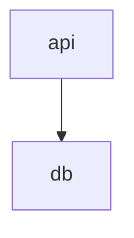

# Archyne for VS Code

Draw Mermaid diagrams on a canvas, in the editor that already has the file
open — a `.mmd` file, or a ` ```mermaid ` block inside the Markdown you were
already writing. The file stays ordinary: VS Code owns it, so the dirty dot,
undo, save and the diff against `HEAD` all behave exactly as they do for the
text.

Nothing leaves your machine. The editor is bundled — no service, no account,
no network call of its own.

## Getting started

Open a `.mmd` or `.mermaid` file, then run **Archyne: Open on the canvas**
from the command palette, or use **Reopen Editor With…** and pick Archyne.

The text editor stays the default. The canvas is a second way to look at the
file, not a replacement for reading it — and edits go both ways: move a node
and the file is rewritten, type in a text editor open on the same file and the
canvas redraws.

Seven diagram families can be edited on the canvas: flowchart, sequence, class,
state, entity-relationship, C4 and `architecture-beta`. Anything else Mermaid
can draw opens read-only, rendered rather than refused.

## Mermaid inside Markdown

Most Mermaid is not in a `.mmd` file — it is a fenced block in a README, an ADR
or a page under `docs/`. Those get an **Open on canvas** action above the fence:

````markdown

````

Click it and the canvas opens beside the file, on that block alone. What you
draw is written back into the same fence, with the rest of the document — and
the block's own indentation, if it sits inside a list item — left alone. The
command palette has the same thing as **Archyne: Open the Mermaid block at the
cursor on the canvas**, which is also how to reach it without a mouse.

Tilde fences and longer backtick fences work. A ` ```mermaid ` block nested
inside a wider fence is example text about Mermaid rather than Mermaid, and is
skipped, as is a block with no closing fence. Set
`archyne.codeLens.enabled` to `false` to turn the action off.

If the block is deleted while its canvas is open, Archyne stops writing to the
file and says so once, rather than guessing at a neighbouring block. The panel
stays open so you can copy your work out of it.

## Saving is VS Code's

While VS Code owns the file, Archyne stands aside from it: no Save, no Save
as…, no Open, no Reload from disk, no New diagram, and no document tabs of its
own. <kbd>Ctrl</kbd>+<kbd>S</kbd> and <kbd>Ctrl</kbd>+<kbd>O</kbd> reach VS
Code rather than being intercepted, and nothing is kept in the extension's own
storage.

Everything that edits the diagram is still here — templates, import, export,
the canvas, the Mermaid source panel — because VS Code saves whatever comes
out of them.

## Known limitations

- **Archyne is alpha, and this carries it.** The accessibility report is
  self-assessed, the translations have not been reviewed by native speakers,
  and there has been no independent security review.
- **The canvas's undo history is its own.** Closing the editor tab and
  reopening it re-reads the file, as it should, but the canvas does not
  restore its undo stack — that one is not VS Code's. <kbd>Ctrl</kbd>+<kbd>Z</kbd>
  in the text editor is unaffected.

## Elsewhere

Archyne also runs as a [web app](https://dariodd.github.io/archyne/), a desktop
application, `npx archyne`, and an MCP server for agents. Source, issues and
the full changelog are at
[github.com/dariodd/archyne](https://github.com/dariodd/archyne).

MIT licensed.
